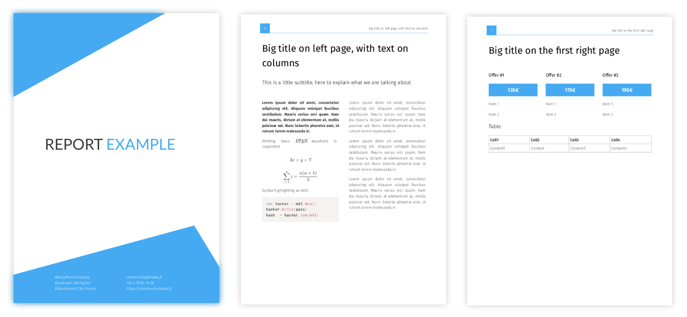

# MarkdownReport

Este pequeno script converte Markdown perfeitamente em elegantes relatórios em PDF.



* Layout de relatório configurável
* Índice automático
* Equações LaTeX
* Destaque de sintaxe
* Imagens redimensionáveis

## Como funciona?

_MarkReport_ pega um arquivo markdown, converte-o em HTML (usando o excelente pacote [blackfriday](https://github.com/russross/blackfriday) do Go), renderiza equações LaTeX e realce de código com JavaScript graças ao [Selenium](https:/ /github.com/SeleniumHQ/selenium) e finalmente converte o HTML enriquecido em PDF graças ao [WeasyPrint](https://weasyprint.org/).

## Como usar?

Basta digitar seu documento como um arquivo Markdown `.md`, usando sintaxe especial nos comentários para informar ao MarkReport como exatamente o PDF final deve ser estruturado.

Você também pode dividir seu documento em vários arquivos Markdown, especificando a ordem na qual esses arquivos serão compilados em um `content.txt` na pasta principal.

Por exemplo :

    corpo.md
    conclusão.md
    conteúdo.txt
    introdução.md

Com `content.txt`:

    introdução
    corpo
    conclusão

### Simple example

Let's take the following example:

```md
<!-- title Test Report -->

## This is a title

### This is a subtitle

<!-- section -->

Lorem ipsum dolor sit amet, consectetur adipiscing elit. Aliquam volutpat faucibus vestibulum.
Mauris varius orci quam. Nam dui mauris, dictum at elementum at, mollis pulvinar est.
Nunc lobortis pharetra erat, id rutrum lorem malesuada in.

<!-- !section -->
```

Abra a pasta onde o arquivo Markdown acima está localizado. Em seguida, execute _MarkReport_:

> cd /caminho/para/markdown/arquivo
> /caminho/para/MarkReport/MarkReport.py

O processo de construção é concluído após alguns segundos e um arquivo `output.pdf` aparece na pasta.


### With a cover and a Table of Contents

```md
<!-- title My Report Title -->
<!-- cover cover.svg -->

# Title</br> <span style="font-size:40px">Smaller part</span> </br> <span class="doc-color">Colored part</span>

John Doe
Designer

john.doe@my-company.fr
+33 6 01 01 01 01
https://john-doe.io

<!-- !cover -->

<!-- toc Table of Contents -->

<!-- columns -->

## This is a title

### This is a subtitle

<!-- section -->

Lorem ipsum dolor sit amet, consectetur adipiscing elit. Aliquam volutpat faucibus vestibulum.
Mauris varius orci quam. Nam dui mauris, dictum at elementum at, mollis pulvinar est.
Nunc lobortis pharetra erat, id rutrum lorem malesuada in.

<!-- !section -->

<!-- !columns -->
```

See the `example` folder for a more detailed demonstration of what _MarkReport_ can achieve.

### Available layout commands

These commands will help you structure your document's layout. They are inserted as comments in the markdown source file.

The title of the documents (meta property):

    <!-- title My Title -->

The document's cover, including a title `Title` and some informations (`Infos`) at the bottom of the page:

    <!-- cover cover.svg -->
    # Title
    Infos
    <!-- !cover -->`

Insert an auto-generated table of contents:

    <!-- toc Table of contents -->

The content of the `sections`' inside will be displayed as regular full-width text:

    <!-- text -->
    ...
    <!-- !text -->

The content of the `sections`' inside will be displayed in a two columns fashion:

    <!-- columns -->
    ...
    <!-- !columns -->

Encapsulates some content:

    <!-- section -->
    <!-- !section -->

First paragraph written in bold:

    <!-- section-bold -->
    <!-- !section -->

Full page colored background marking the beginning of a new chapter:

    <!-- chapter -->
    <!-- !chapter -->

Vertical list of paragraphs with clear header text:

    <!-- items -->
    ...
    <!-- !items -->

Horizontal list of offers, with clear titles:

    <!-- offers -->
    ...
    <!-- !offers -->

List of paragraphs with their content indented:

    <!-- specs -->
    ...
    <!-- !specs -->


### Sinalizadores de linha de comando disponíveis

- `--basic` O interpretador Javascript está desabilitado, permitindo compilações mais rápidas, mas sem realce de sintaxe ou suporte a LaTeX
- `--watch` O script _MarkReport_ não irá parar após a primeira compilação, mas permanecerá inativo e reconstruirá t
assim que uma alteração for feita na pasta atual, permitindo compilações a quente mais rápidas
- `--quiet` Nenhuma saída será exibida durante o processo de construção

## Installation instructions

Some Python packages are needed to run the program. It's easy to get them with pip3:

    pip3 install weasyprint
    pip3 install pyinotify
    pip3 install selenium

Compilation of md-parsing

    export GOPATH=~/.go
    go get gopkg.in/russross/blackfriday.v2
    go build -i md-parsing.go

The firefox driver is used to interpret JavaScript inside the HTML page generated from Markdown. You need to grab `geckodriver` in order to make it work:

    wget https://github.com/mozilla/geckodriver/releases/download/v0.24.0/geckodriver-v0.24.0-linux64.tar.gz
    tar -xvzf geckodriver*
    sudo mv geckodriver /usr/local/bin/

You're now ready to go.

## Add Dockerfile to run in container


- build dockerfile

> docker rm -f relatorio

> docker build --no-cache -t relatorio:v1.0 . 

> docker build --no-cache --progress=plain -t relatorio:v1.0 .

> docker run -it --name relatorio relatorio:v1.0

## accesando ao docker

> docker run -it --name relatorio relatorio:v1.0

> docker exec -it relatorio bash

## docker compose

> docker compose up -d

> docker compose down

> docker compose build

## comandos docker

```shell
docker exec -it relatorio:v1.0 bash -c "cd /caminho/para/markdown/arquivo && /caminho/para/MarkReport/MarkReport.py"

```

# Arquitetura de pastas

```
MarkReport\
├── Dockerfile
├── docker-compose.yml
├── README.md
└── MarkReport\
    ├── MarkReport.py
    ├── md-parsing.go
    └── base.html
```

## teste 

```shell
# Entrar no container
docker-compose exec relatorio bash

# Dentro do container
cd /app/input
python3 /app/MarkReport/MarkReport.py

# ou
docker-compose exec markreport sh -c "cd /app/input && python3 /app/MarkReport/MarkReport.py"

docker-compose logs -f
```